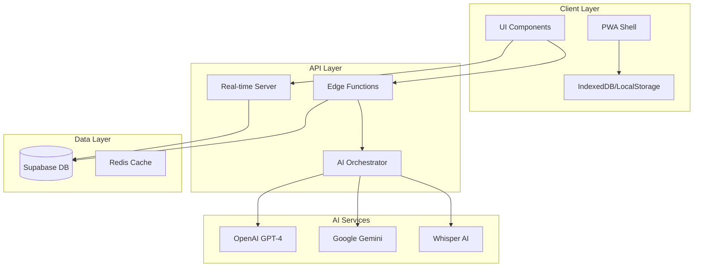
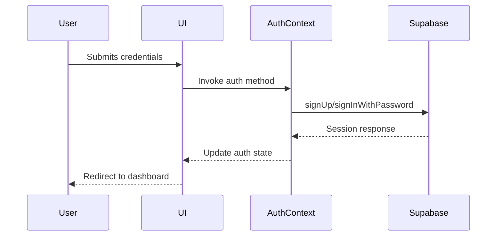
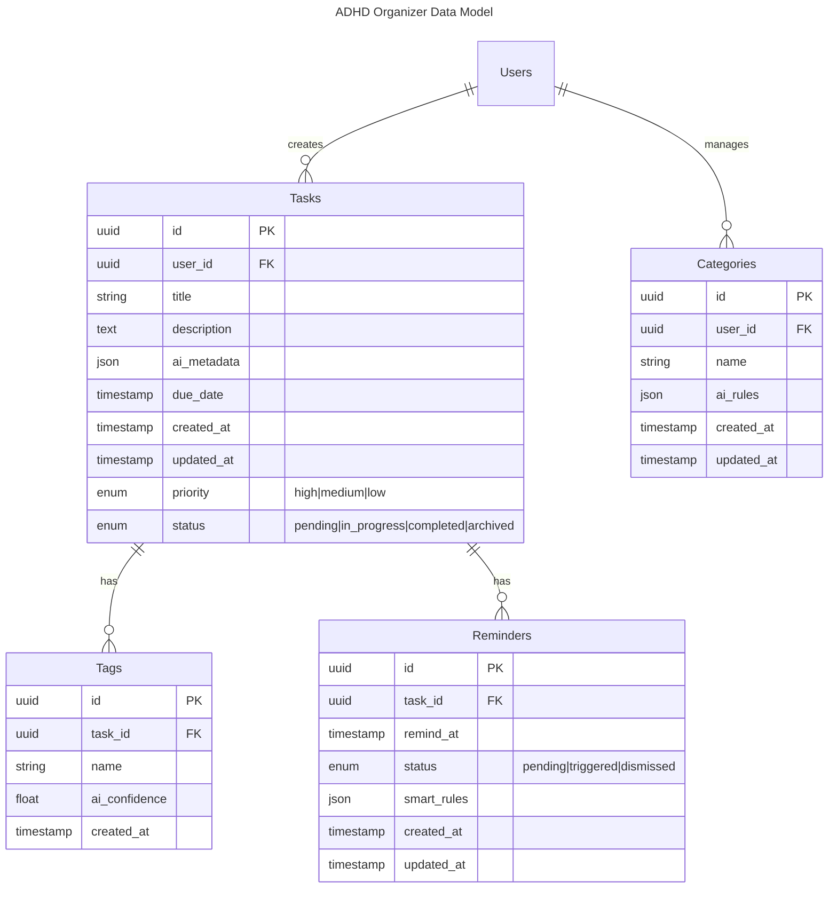

# Architecture Document for ADHD Organizer

<version>1.0.0</version>

## Status: Approved

## System Overview

The ADHD Organizer is built as a modern web application with progressive web app (PWA) capabilities, leveraging a serverless architecture for scalability and real-time features.

## Architecture Diagram



## Core Components

### 1. Frontend Architecture

#### UI Layer

- Next.js 14 App Router for routing and server components
- React 18 for component architecture
- TailwindCSS with Headless UI for styling
- PWA implementation for offline support

#### State Management

- React Context for global state
- SWR for data fetching and caching
- Client-side navigation for UI updates

#### Component Structure

- PascalCase for component names (e.g., `UserProfile.tsx`)
- Contextual components stored in `/components` directories
- Layout components for consistent UI structure
- Protected routes using middleware

### 2. Backend Architecture

#### API Layer

- Vercel Edge Functions for API endpoints
- Supabase client initialized with environment variables
- Protected data access through Row Level Security (RLS) policies
- Static generation with server-side props where appropriate
- Client-side data fetching with SWR for dynamic content

#### Authentication Flow



#### Dashboard Data Flow

1. Environment variables loaded through Next.js runtime config
2. Supabase client initialized with environment variables
3. Authorized users fetch data from protected RLS policies
4. Data displayed through React components with loading states
5. UI updates managed through client-side navigation

#### AI Orchestration Layer

- Custom AI pipeline for model coordination
- Streaming responses for real-time AI feedback
- Model fallback strategies
- Caching of AI responses

### 3. Database Schema



## Security Architecture

### Authentication

- Supabase Auth with multiple providers
- JWT token-based session management
- Refresh token rotation
- 2FA support (future)

### Data Protection

- End-to-end encryption for sensitive data
- At-rest encryption in Supabase
- Client-side encryption for offline data
- Rate limiting on AI endpoints

## Scalability Considerations

### Performance Optimizations

- Edge caching for static assets
- Incremental Static Regeneration (ISR)
- Optimistic UI updates
- Lazy loading of AI features

### Real-time Architecture

- WebSocket connections for live updates
- Fallback to polling when needed
- Message queue for AI processing
- Broadcast channels for notifications

## Development Workflow

### Project Structure

```
├── src/
│   ├── app/               # Next.js app router entries
│   │   ├── dashboard/     # Authenticated area
│   │   │   └── components # Dashboard-specific components
│   │   ├── auth/          # Authentication pages
│   │   │   ├── login/     # Login page
│   │   │   ├── signup/    # Registration page
│   │   │   ├── forgot-password/ # Password recovery
│   │   │   └── reset-password/  # Password reset
│   │   └── layout.tsx     # Root layout
│   │
│   ├── contexts/          # Global state management
│   ├── lib/               # Shared utilities
│   └── test/              # Test configurations
│
├── docs/                  # Architectural documentation
└── public/                # Static assets
```

### File Naming Conventions

- **Components**: PascalCase (e.g., `UserProfile.tsx`)
- **Contexts**: `*Context.tsx` (e.g., `AuthContext.tsx`)
- **Pages**: Lowercase directory names (e.g., `login/page.tsx`)
- **Tests**: `*.test.tsx` alongside components

### CI/CD Pipeline

- GitHub Actions for automated testing
- Vercel for automated deployments
- Environment-based configuration
- Feature flags for gradual rollout

### Testing Strategy

#### Unit & Integration Testing

- Unit tests with Vitest
- Integration tests with Testing Library
- E2E tests with Playwright
- Component testing with Storybook

#### AI Testing Framework

##### Core AI Test Suites

```typescript
// Example AI test structure
describe("AI Task Categorization", () => {
  const testCases = [
    {
      input: "Schedule doctor appointment for next week",
      expected: {
        category: "health",
        priority: "high",
        tags: ["medical", "appointment"],
      },
    },
    // More test cases...
  ];
});
```

##### AI Testing Components

- **Model Accuracy Testing**

  - Task categorization precision
  - Priority assignment accuracy
  - Tag generation relevance
  - Voice transcription accuracy

- **Performance Testing**

  - Response time benchmarking
  - Model latency monitoring
  - Resource utilization tracking
  - Concurrent request handling

- **Validation Datasets**
  - Curated ADHD task samples
  - Voice command test suite
  - Multi-language test cases
  - Edge case scenarios

##### AI Test Automation

- Automated validation pipelines
- A/B testing framework for model comparison
- Performance regression detection
- Accuracy threshold monitoring

##### Test Data Management

- Version-controlled test datasets
- Synthetic data generation
- Privacy-compliant test data
- Cross-validation sets

## Monitoring and Analytics

### Performance Monitoring

- Vercel Analytics for frontend metrics
- Custom APM for AI performance
- Error tracking with Sentry
- User behavior analytics

### AI Performance Metrics

- Model response times
- Accuracy tracking
- Usage patterns
- Cost optimization

## Future Considerations

### Scalability

- Horizontal scaling of AI services
- Multi-region deployment
- Enhanced offline capabilities
- Advanced caching strategies

### AI Enhancements

- Custom model fine-tuning
- Enhanced context awareness
- Improved prioritization algorithms
- Advanced natural language processing
