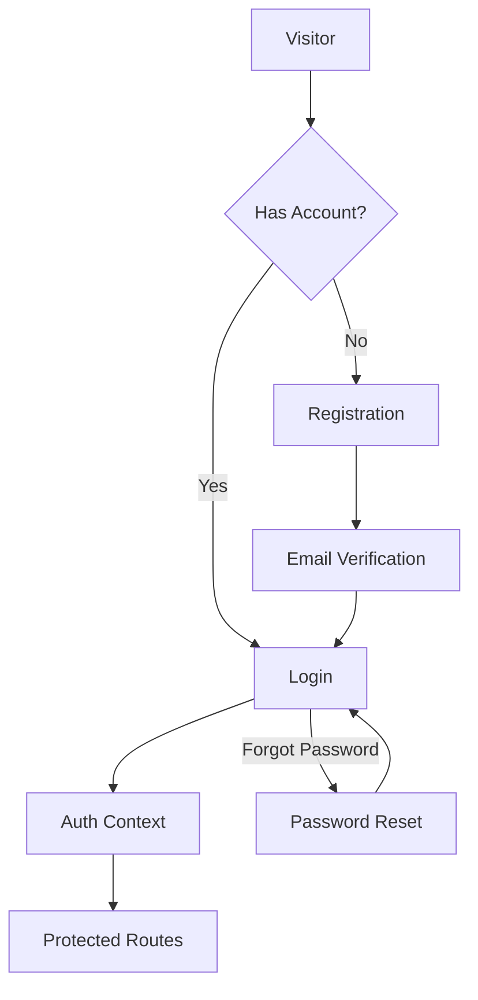

# Epic-1: Core Infrastructure & Authentication
# Story-2: Implement user authentication system

## Story

**As a** user with ADHD
**I want** to securely sign up and log in to the ADHD Organizer app
**so that** I can access my personalized tasks and features

## Status

Approved

## Context

This is the second story of Epic-1, which focuses on implementing a comprehensive user authentication system for the ADHD Organizer app. The first story (Story-1) has established the foundation with Next.js, TypeScript, TailwindCSS, Supabase, and ShadcnUI.

The ADHD Organizer app requires a secure and user-friendly authentication system that includes registration, login, password recovery, and email verification. The authentication system will be built on top of Supabase Auth, which is already integrated into the project through the Project Starter Template.

## Estimation

Story Points: 2

## Tasks

1. - [ ] Enhance User Registration
   1. - [ ] Implement user registration form with ShadcnUI components
   2. - [ ] Add client-side form validation
   3. - [ ] Implement server-side validation
   4. - [ ] Add error handling and user feedback

2. - [x] Enhance User Login
   1. - [x] Utilize ShadcnUI login-04 block as the foundation
   2. - [x] Customize the login form to match application branding
   3. - [x] Connect to Supabase authentication
   4. - [x] Add error handling and user feedback

3. - [x] Password Recovery
   1. - [x] Implement password reset request form
   2. - [x] Create password reset confirmation page
   3. - [x] Implement email-based password reset flow
   4. - [x] Add error handling and user feedback

## Constraints

- Must use ShadcnUI components for form elements
- Must implement client-side and server-side validation
- Must provide user-friendly error messages
- Must follow security best practices for authentication
- Must ensure UI is accessible and ADHD-friendly

## Data Models / Schema

The authentication system will use the Supabase Auth schema, which includes:

- User authentication table (managed by Supabase Auth)
- User profiles table:
  ```sql
  create table public.profiles (
    id uuid references auth.users on delete cascade not null primary key,
    updated_at timestamp with time zone,
    username text unique,
    full_name text,
    avatar_url text,
    website text,
    settings jsonb,
    constraint username_length check (char_length(username) >= 3)
  );
  
  -- Set up Row Level Security
  alter table public.profiles enable row level security;
  
  -- User can only view and update their own profile
  create policy "Users can view their own profile" on profiles
    for select using (auth.uid() = id);
  
  create policy "Users can update their own profile" on profiles
    for update using (auth.uid() = id);
  ```

## Structure

The authentication system will build upon the existing structure:

- `/src/app/auth/` - Authentication-related pages
  - `/auth/signup` - Registration page
  - `/auth/login` - Login page
  - `/auth/forgot-password` - Password recovery request
  - `/auth/reset-password` - Password reset confirmation
  - `/auth/callback` - OAuth callback handler
- `/src/components/` - Authentication-related components
  - `login-form.tsx` - Login form component used across the app
- `/src/contexts/AuthContext.tsx` - Auth state management
- `/src/lib/auth.ts` - Authentication utilities

## Diagrams



## Dev Notes

- The Project Starter Template already includes basic authentication with Supabase, but it needs to be enhanced with ADHD-friendly UI and additional features
- ShadcnUI login-04 block has been installed using `npx shadcn@latest add login-04`
- The login-04 block provides a modern, split-screen layout with social login options
- Client-side validation will be implemented to provide immediate feedback to users
- Error messages will be designed to be clear and non-distracting for users with ADHD
- Social login options (Google) have been implemented to simplify the login process
- User Profile Management will be handled in a separate story

## Chat Command Log

- Initial creation of the story file
- Added ShadcnUI login-04 block using `npx shadcn@latest add login-04`
- Implemented login page with ShadcnUI login-04 block
- Connected login form to Supabase authentication
- Added loading states and error handling
- Created forgot-password and reset-password pages
- Implemented password reset flow using Supabase Auth
- Refactored authentication pages into `/auth` directory structure
- Updated all links and redirects to use the new auth paths
- Removed duplicate pages and unused components
