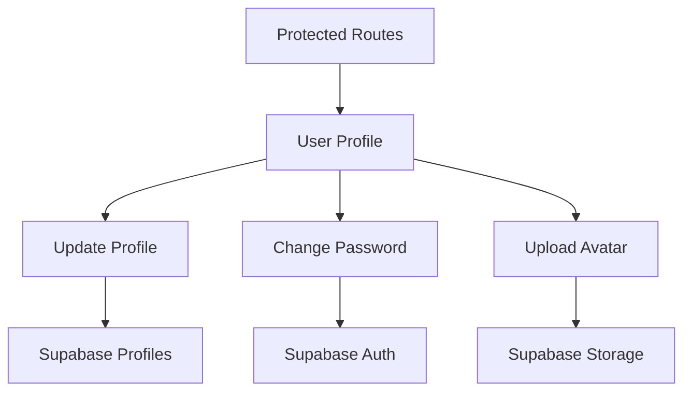

# Epic-1: Core Infrastructure & Authentication

# Story-3: Implement User Profile Management

## Story

**As a** user with ADHD
**I want** to manage my profile information and settings
**so that** I can personalize my experience and maintain my account

## Status

In Progress

## Context

This is the third story of Epic-1, which focuses on implementing user profile management for the ADHD Organizer app. The previous stories (Story-1 and Story-2) have established the foundation with Next.js, TypeScript, TailwindCSS, Supabase, and ShadcnUI, and implemented the authentication system.

The ADHD Organizer app requires a user profile management system that allows users to view and update their profile information, change their password, and upload a profile avatar. This will enhance the personalization of the app and provide users with control over their account settings.

## Estimation

Story Points: 2

## Tasks

1. - [x] Create User Profile Page

   1. - [x] Design and implement user profile page layout
   2. - [x] Display current user information
   3. - [x] Add navigation and accessibility features
   4. - [x] Implement responsive design for mobile and desktop
   5. - [x] Implement user dropdown menu in navigation bar

2. - [x] Implement Profile Update Functionality

   1. - [x] Create form for updating user information
   2. - [x] Add client-side form validation
   3. - [x] Implement server-side validation
   4. - [x] Connect to Supabase profiles table
   5. - [x] Add error handling and success feedback

3. - [x] Add Password Change Feature

   1. - [x] Create password change form
   2. - [x] Implement password strength validation
   3. - [x] Connect to Supabase authentication
   4. - [x] Add error handling and success feedback

4. - [ ] Implement Profile Avatar Uploads

   1. - [ ] Create avatar upload component
   2. - [ ] Connect to Supabase Storage
   3. - [ ] Add image cropping and resizing
   4. - [ ] Implement avatar preview and update

5. - [x] Authentication System Evaluation
   1. - [x] Review current authentication implementation
   2. - [x] Analyze strengths and weaknesses
   3. - [x] Document improvement opportunities
   4. - [x] Prioritize authentication enhancements

## Constraints

- Must use ShadcnUI components for form elements
- Must implement client-side and server-side validation
- Must provide user-friendly error messages
- Must follow security best practices
- Must ensure UI is accessible and ADHD-friendly
- Avatar uploads must be limited to reasonable file sizes (< 2MB)
- Image processing should be done client-side when possible

## Data Models / Schema

The profile management system will use the existing Supabase schema:

- User authentication table (managed by Supabase Auth)
- User profiles table:

  ```sql
  create table public.profiles (
    id uuid references auth.users on delete cascade not null primary key,
    updated_at timestamp with time zone,
    username text unique,
    full_name text,
    avatar_url text,
    website text,
    bio text,
    location text,
    settings jsonb,
    constraint username_length check (char_length(username) >= 3)
  );

  -- Set up Row Level Security
  alter table public.profiles enable row level security;

  -- User can only view and update their own profile
  create policy "Users can view their own profile" on profiles
    for select using (auth.uid() = id);

  create policy "Users can update their own profile" on profiles
    for update using (auth.uid() = id);
  ```

## Structure

The profile management system will build upon the existing structure:

- `/src/app/profile/` - Profile-related pages
  - `/profile/` - Main profile page
  - `/profile/settings` - User settings page
- `/src/components/profile/` - Profile-related components
  - `profile-form.tsx` - Profile update form
  - `password-form.tsx` - Password change form
  - `avatar-upload.tsx` - Avatar upload component
- `/src/lib/profile.ts` - Profile utilities

## Diagrams



## Dev Notes

- The profile page should be accessible only to authenticated users
- The profile update form should pre-populate with the user's current information
- The password change feature should require the current password for security
- Avatar uploads should include preview and cropping functionality
- All forms should provide clear feedback on success or failure
- Consider adding a "delete account" option with appropriate safeguards
- Error messages should be designed to be clear and non-distracting for users with ADHD
- Authentication system evaluation completed with following findings:
  - Current implementation follows many Supabase Auth best practices
  - Areas for improvement include adding middleware for more consistent route protection
  - Enhanced error handling with user-friendly messages needed
  - Should consider implementing RBAC for more fine-grained permissions
  - Session management features (timeouts, refresh tokens) need enhancement
  - Social login implementations are working well but need better error handling

## Chat Command Log

- Initial creation of the story file
- Added profile update functionality with enhanced validation and error handling
- Added bio and location fields to the profiles table
- Updated schema documentation
- Enhanced password change form with:
  - Real-time password strength validation
  - Visual password requirements checklist
  - Improved error handling and feedback
  - Accessibility improvements
- Conducted comprehensive authentication system evaluation
- Updated tasks and dev notes with authentication findings
