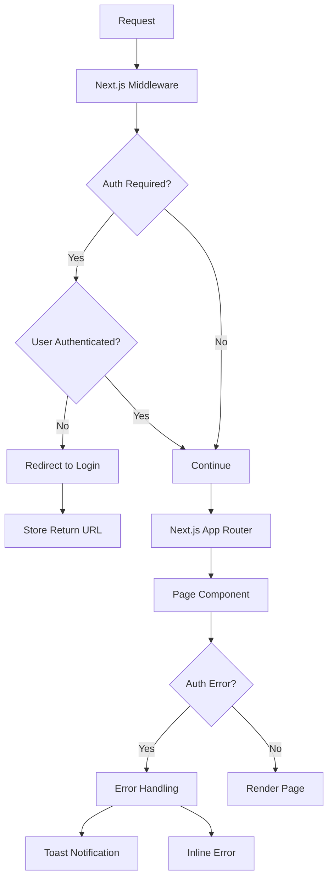

# Epic-1: Core Infrastructure & Authentication

# Story-4: Enhance Authentication Security and UX

## Story

**As a** user with ADHD
**I want** a secure, reliable, and user-friendly authentication experience
**so that** I can access my account safely with minimal friction

## Status

Planned

## Context

This is the fourth story of Epic-1, which focuses on enhancing the authentication system based on the comprehensive review documented in auth-review.md. The previous stories (Story-1, Story-2, and Story-3) have established the foundation with Next.js, TypeScript, TailwindCSS, and Supabase, implemented basic authentication, and added profile management.

While the current authentication system is functional, the review identified several areas for improvement in terms of security, user experience, and consistency. This story will implement the highest priority improvements to create a more robust and ADHD-friendly authentication system.

## Estimation

Story Points: 3

## Tasks

1. - [ ] Authentication Middleware Implementation

   1. - [ ] Create Next.js middleware for route protection
   2. - [ ] Standardize auth checking across protected routes
   3. - [ ] Add proper redirects with return URLs
   4. - [ ] Implement consistent security patterns
   5. - [ ] Test middleware with various routes and scenarios

2. - [ ] Error Handling Enhancements

   1. - [ ] Create auth error handling utilities
   2. - [ ] Design ADHD-friendly error presentation components
   3. - [ ] Implement toast notifications for auth events
   4. - [ ] Add inline form error messages
   5. - [ ] Standardize error handling across auth flows

3. - [ ] Authentication UX Improvements

   1. - [ ] Add loading states for all auth actions
   2. - [ ] Implement progressive form validation
   3. - [ ] Add "remember me" functionality
   4. - [ ] Enhance form accessibility features
   5. - [ ] Implement session persistence options

4. - [ ] Testing and Documentation
   1. - [ ] Write unit tests for new auth utilities
   2. - [ ] Test all error scenarios
   3. - [ ] Document new authentication patterns
   4. - [ ] Create auth flow diagrams
   5. - [ ] Update technical documentation

## Constraints

- Must maintain compatibility with existing auth system
- Must not break existing authentication flows
- Must prioritize user experience for people with ADHD
- Must follow security best practices
- Must implement ADHD-friendly error messaging
- Must maintain or improve performance

## Data Models / Schema

No new schema changes are required for this story, as it focuses on enhancing the existing authentication system.

## Structure

The authentication enhancements will build upon the existing structure:

- `/src/middleware.ts` - New Next.js middleware for route protection
- `/src/lib/auth/` - Enhanced authentication utilities
  - `errors.ts` - Auth error handling utilities
  - `middleware.ts` - Middleware helper functions
  - `session.ts` - Session management utilities
- `/src/components/auth/` - Enhanced auth components
  - `auth-error.tsx` - Error presentation component
  - `auth-toast.tsx` - Toast notification component

## Diagrams



## Dev Notes

- The middleware implementation should use the `createClient` function from `@supabase/supabase-ssr`
- Error handling should be centralized to ensure consistent user experience
- Consider the specific needs of users with ADHD when designing error messages and authentication flows
- Loading states should be clear but not distracting
- Ensure that authentication flows are as frictionless as possible while maintaining security
- Remember that users with ADHD may be more likely to abandon authentication if it's too complex
- Error messages should be clear, specific, and provide actionable guidance
- Test thoroughly to ensure no regressions in existing functionality

## Technical Details

### Middleware Implementation

The middleware will be implemented using Next.js middleware and the Supabase SSR client:

```typescript
// middleware.ts
import { NextRequest, NextResponse } from "next/server";
import { createClient } from "@supabase/supabase-ssr";

export async function middleware(request: NextRequest) {
  // Create supabase client
  const { supabase, response } = createClient(request);

  // Get session
  const {
    data: { session },
  } = await supabase.auth.getSession();

  // Define route patterns
  const isProtectedRoute =
    request.nextUrl.pathname.startsWith("/dashboard") ||
    request.nextUrl.pathname.startsWith("/profile");
  const isAuthRoute = request.nextUrl.pathname.startsWith("/auth");

  // Auth logic
  if (isProtectedRoute && !session) {
    // Store the original URL to redirect back after login
    const returnUrl = encodeURIComponent(request.nextUrl.pathname);
    return NextResponse.redirect(
      new URL(`/auth/login?returnUrl=${returnUrl}`, request.url)
    );
  }

  if (isAuthRoute && session) {
    // Get return URL from query params or default to dashboard
    const url = new URL(request.url);
    const returnUrl = url.searchParams.get("returnUrl") || "/dashboard";
    return NextResponse.redirect(
      new URL(decodeURIComponent(returnUrl), request.url)
    );
  }

  return response;
}

export const config = {
  matcher: ["/dashboard/:path*", "/profile/:path*", "/auth/:path*"],
};
```

### Error Handling Utilities

Enhanced error handling will be implemented with utilities that provide consistent and user-friendly error messages:

```typescript
// auth/errors.ts
export type AuthErrorType =
  | "invalid_credentials"
  | "user_not_found"
  | "email_in_use"
  | "weak_password"
  | "expired_session"
  | "network_error"
  | "too_many_requests"
  | "unknown";

export interface AuthError {
  type: AuthErrorType;
  message: string;
  actionable?: string;
}

export const getAuthErrorMessage = (error: any): AuthError => {
  const code = error?.code || error?.message || "unknown";

  switch (code) {
    case "auth/invalid-email":
    case "auth/user-not-found":
    case "auth/wrong-password":
    case "invalid-credentials":
      return {
        type: "invalid_credentials",
        message: "The email or password you entered is incorrect.",
        actionable: "Please double-check your information and try again.",
      };
    case "auth/email-already-in-use":
    case "email-already-in-use":
      return {
        type: "email_in_use",
        message: "This email is already registered.",
        actionable: "Try logging in instead, or use a different email.",
      };
    // More cases here...
    default:
      return {
        type: "unknown",
        message: "An unexpected error occurred.",
        actionable:
          "Please try again or contact support if the problem persists.",
      };
  }
};
```

## Chat Command Log

- Initial creation of the story file
- Created comprehensive review of authentication system in auth-review.md
- Identified key areas for improvement
- Documented implementation plan for authentication enhancements
