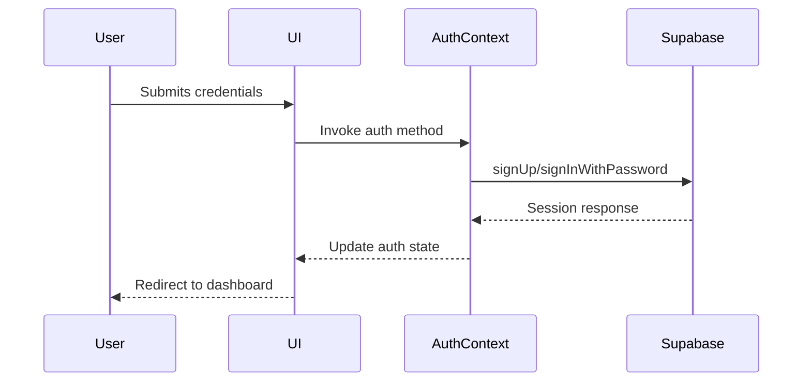

# Application Architecture

## Tech Stack Overview

- **Framework**: Next.js 14 (App Router)
- **Authentication**: Supabase Auth
- **Styling**: Tailwind CSS + Headless UI
- **State Management**: React Context
- **Database**: Supabase PostgreSQL
- **Testing**: Vitest + React Testing Library

## Core Architectural Concepts

### Authentication Flow

### Dashboard Data Flow
1. Environment variables loaded through Next.js runtime config
2. Supabase client initialized with environment variables
3. Authorized users fetch data from protected RLS policies
4. Data displayed through React components with loading states
5. UI updates managed through client-side navigation

### Deployment Architecture
- Static assets served through CDN
- Serverless functions for dynamic routes
- Environment-specific configurations
- Automated CI/CD pipeline integration 